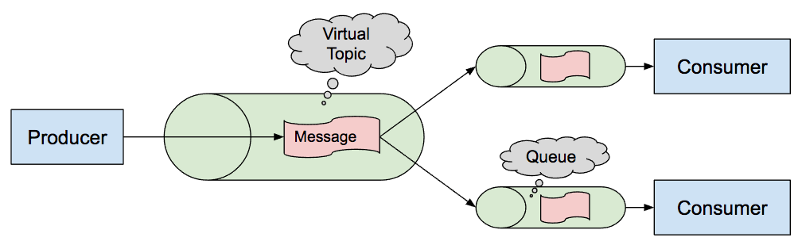

# ActiveMQ

## Prerequisites:

Download and install classic ActiveMQ.

## Practical Task:

III. Implement subscriber scaling, i.e. create n subscribers to a topic with the same ClientID (see Virtual Topics in ActiveMQ)

